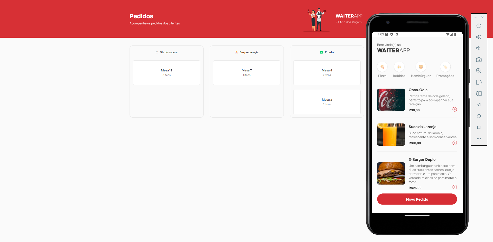

<h1 align="center">WAITERAPP - O App do Garçom</h1>

https://github.com/user-attachments/assets/3909a591-501d-49cc-ae70-4047f564c728

O WaiterApp é uma ferramenta projetada para facilitar o trabalho de garçons, agilizando o processo de atendimento e gestão de pedidos. O objetivo do app é melhorar a eficiência dos serviços em restaurantes, bares e cafés.

## 🏆 Principais funcionalidades
- App mobile: Para o garçom anotar os pedidos.
- Dashboard web: Para visualização dos pedidos realizados.
- Real-time: Comunicação em tempo-real com WebSockets

## 📚 Linguagens e libs utilizadas

- [React](https://reactjs.org/)
- [Node](https://nodejs.org/pt) 
- [MongoDB](https://www.mongodb.com/)
- [WebSockets com Socket.IO](https://socket.io/) 
